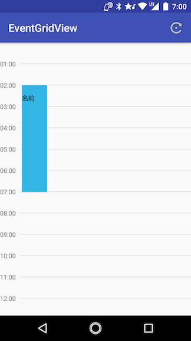
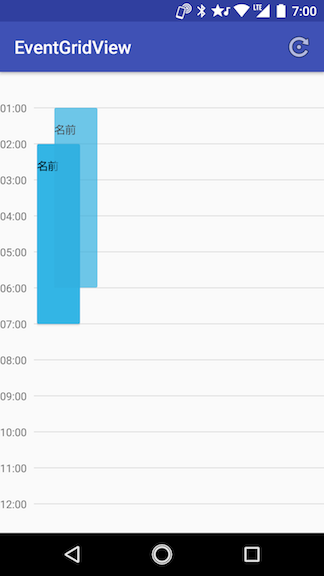

# EventGridView

A day events view. Draggable.

 

- Expand over 24h (max 48h)
- Drag and drop. Expand and shrink.

# Setup
Require Android 5.0+

```
implementation 'jp.kuluna:eventgridview:1.2.1'
```

# Simple Usage


# Contributing
1. Fork it!
1. Create your feature branch: git checkout -b my-new-feature
1. Commit your changes: git commit -am 'Add some feature'
1. Push to the branch: git push origin my-new-feature
1. Submit a pull request :D

# License
MIT License.
